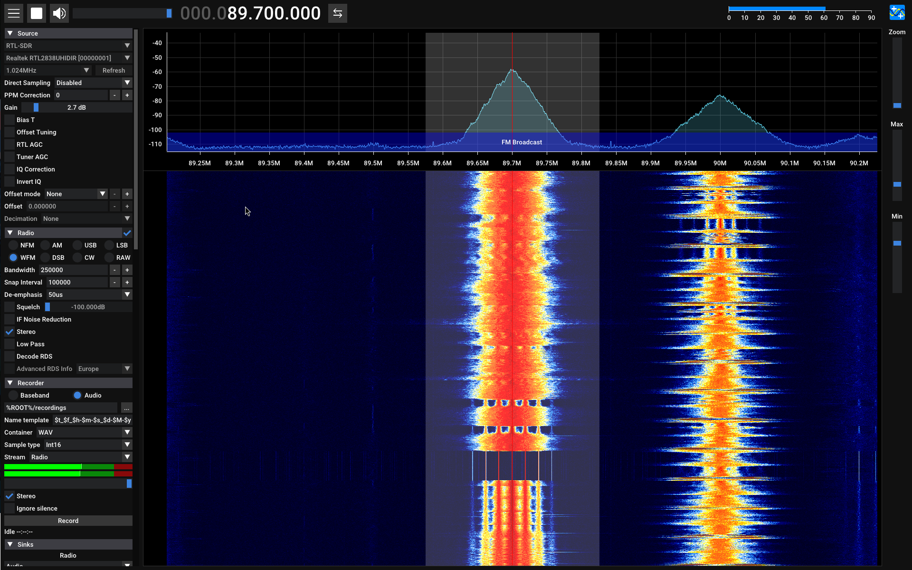

# Soundcard FM - Stereo DDS Modulator & USB Audio Interface

A sophisticated hybrid embedded system combining **FPGA** and **STM32F4** microcontroller for high-fidelity stereo FM transmission via USB audio interface.


*Active FM stereo transmission received on SDR++ software*

## Project Overview

This project implements a complete **USB Audio Device** that doubles as an **FM stereo transmitter**:

- **Host Interface**: USB 2.0 Full-Speed Audio Device (plug-and-play on Linux/Windows/macOS)
- **Audio Processing**: Pre-emphasis filter (50 µs time constant) on STM32
- **I2S Link**: Real-time stereo audio streaming from STM32 to FPGA
- **RF Modulation**: Hardware FM stereo encoder on FPGA with DDS-based synthesizer
- **Output**: Programmable RF transmitter at configurable frequencies (e.g., 89.7 MHz)

## System Architecture

```
┌─────────────────────────────────────────────────────────┐
│                    USB Host (PC/Phone)                  │
│              USB Audio Class Device                     │
└──────────────────────────┬──────────────────────────────┘
                           │ USB 2.0 FS (12 Mbps)
                           │
                    ┌──────▼────────┐
                    │    STM32F4    │
                    │  (MCU + USB)  │
                    └──────┬────────┘
                           │
                 16-bit Stereo Audio
                    I2S (Slave RX)
                           │
                    ┌──────▼────────┐
                    │  FPGA (Spartan)
                    │  (DDS + FM)   │
                    └──────┬────────┘
                           │
                           └──▶ RF Output
                              (89.7 MHz FM)
```

## Features

### STM32F4 MCU Side
- ✅ USB Audio Class 1.0 compliant device
- ✅ 16-bit stereo @ 48 kHz sample rate
- ✅ Pre-emphasis filter (IIR) for FM broadcast standard
- ✅ Ring buffer (8192 samples / ~170 ms) with DMA-driven I2S
- ✅ UART debug logging

**Pre-emphasis Implementation:**
```
y[n] = 3.40 * x[n] - 2.40 * x[n-1]
τ = 50 µs (standard FM pre-emphasis)
Sample rate: 48 kHz
```

### FPGA Side (Xilinx Spartan)
- ✅ I2S slave receiver (receives from STM32)
- ✅ DDS (Direct Digital Synthesis) oscillator
  - 25-bit phase accumulator
  - Programmable phase increment for frequency tuning
- ✅ FM stereo encoder (ITU-R BS.412-9 compliant)
  - L/R sum multiplex path (baseband 0-15 kHz)
  - L/R difference modulated on 38 kHz subcarrier
  - 19 kHz pilot tone insertion
  - Stereo pilot for automatic detection
- ✅ RF transmitter with digital upconversion
  - DCM-based clock multiplier (10 MHz → 180-200 MHz)
  - GPIO-based bit-banged RF output

## Hardware Requirements

| Component | Specification |
|-----------|---------------|
| **Microcontroller** | STM32F401CC (168 MHz ARM Cortex-M4) |
| **FPGA** | Xilinx Spartan (ISE 14.7 compatible) |
| **Crystal** | 10 MHz reference clock (shared) |
| **USB** | Full-Speed (12 Mbps), Type-B connector |
| **Audio I2S** | STM32 I2S2 ↔ FPGA I2S slave |
| **RF Output** | GPIO bit-bang or analog reconstruction |

## Software Architecture

### STM32F4 Firmware
```
Core/
├── Src/
│   ├── main.c              # Entry point, USB device init
│   ├── audio_buff_utils.c  # Pre-emphasis + ring buffer
│   ├── stm32f4xx_it.c      # Interrupt handlers
│   ├── system_stm32f4xx.c  # System init
│   └── syscalls.c          # Printf support
└── Inc/
    ├── main.h              # Configuration
    ├── buf_param.h         # Audio buffer parameters
    └── stm32f4xx_hal_conf.h
```

**Key Parameters** (`Core/Inc/buf_param.h`):
```c
#define BUFFER_SIZE 8192      // Samples per channel
#define SAMPLE_RATE 48000.0f  // Hz
#define FREQUENCY 440.0f      // Placeholder
```

### FPGA RTL Design
```
fpga_dds_fm_project/
├── main.v               # Top-level instantiation
├── i2s.v                # I2S slave receiver (32-bit frames)
├── fm_stereo.v          # Stereo encoder + DDS (~600 lines)
├── radio_tx.v           # RF transmitter with frequency control
└── i2s_tb.v             # Testbench (32-bit stereo frames)
```

**FPGA Clocking:**
- Input: 10 MHz reference (from STM32 or external oscillator)
- I2S: 48 kHz sample rate (standard)
- FM modulator: 9.5 MHz internal clock (via DCM)
- RF output: 180-200 MHz (configurable via DCM phase control)

**DDS Frequency Calculation:**
```
phase_increment = (desired_freq * 2^25) / clock_freq
Example: 89.7 MHz on 180 MHz clock = phase_inc ~15,049,163
```

## USB Audio Interface

The STM32 enumerates as a standard USB Audio Device:

```
bDeviceClass: Audio
bInterfaceClass: Audio Streaming
wFormatTag: PCM
bNrChannels: 2 (Stereo)
tSamFreq: 48000 Hz
bBitResolution: 16 bits
```

### Endpoint Configuration
- **EP0**: Control (device management, feature requests)
- **EP1**: Isochronous IN (audio stream from host)
- **EP82**: Interrupt (optional status)

### Pre-emphasis Filter Response
The STM32 applies broadcast-standard pre-emphasis before FM modulation:
- Boost high frequencies by ~17 dB @ 10 kHz
- Time constant: τ = 50 µs
- Purpose: Improve SNR in FM transmission

## Compilation & Deployment

### STM32 Firmware

**Build with CMake:**
```bash
cd /path/to/soundcard_fm
mkdir build && cd build
cmake .. -DCMAKE_TOOLCHAIN_FILE=../cmake/gcc-arm-none-eabi.cmake
make
# Output: soundcard_fm.elf
```

**Flash to Device:**
```bash
# Using STM32CubeProgrammer
STM32_Programmer_CLI -c port=SWD -d build/soundcard_fm.elf

# Or using OpenOCD
openocd -f board/stm32f4discovery.cfg \
  -c "program build/soundcard_fm.elf verify reset exit"
```

**Debug UART:**
- USART2 @ 115200 baud
- Connects to ST-Link virtual COM port

### FPGA Bitstream

**Xilinx ISE Flow:**
```bash
cd fpga_dds_fm_project
make bitstream
# Output: main.bit
```

**Program FPGA:**
```bash
# JTAG programming
impact -batch <impact_commands>
# Or use Vivado Hardware Manager
```

**Verilog Simulation:**
```bash
cd fpga_dds_fm_project
iverilog -o i2s_sim i2s_tb.v i2s.v fm_stereo.v radio_tx.v
vvp i2s_sim
gtkwave i2s_wave.vcd &
```

## Testbenches & Verification

### I2S Slave Testbench
File: `fpga_dds_fm_project/i2s_tb.v`

Tests I2S frame reception with:
- Pattern: 0x55555555 (0101...) and 0xAAAAAAAA (1010...)
- Verifies correct channel separation (L/R)
- Validates data_updated strobing
- Captures waveforms in `i2s_wave.vcd`

**Run:**
```bash
cd fpga_dds_fm_project
make simulate
```

## Configuration & Tuning

### Frequency Tuning (FPGA)

Edit `fpga_dds_fm_project/radio_tx.v`:
```verilog
`define CENTER_FREQ 89_700_000    // 89.7 MHz
`define DEVIATION 2_500           // ±2.5 kHz
`define PHASE_INC 25'd15049163    // For 180 MHz clock
```

Recalculate phase increment:
```python
import math
center_freq = 89_700_000  # Hz
rf_clock = 180_000_000    # Hz
phase_inc = int((center_freq * (2**25)) / rf_clock)
print(f"Phase increment: {phase_inc}")
```

### Pre-emphasis Tuning (STM32)

Edit `Core/Src/audio_buff_utils.c`:
```c
#define PREEMPH_COEFF_CURR 13926  // 3.40 * 4096
#define PREEMPH_COEFF_PREV 9830   // 2.40 * 4096
```

### I2S Clock Domain Crossing

The I2S slave on FPGA synchronizes with STM32:
- **Clock**: BCLK from STM32 I2S2 (typically 1.536 MHz @ 48 kHz)
- **Frame sync**: LRCLK (48 kHz)
- **Data**: 32-bit frames (16-bit L + 16-bit R per frame)

## Performance Metrics

| Metric | Value |
|--------|-------|
| USB Latency | ~1-2 ms (isochronous) |
| Audio Buffer | 8192 samples = 170.67 ms |
| Pre-emphasis Delay | 1 sample (~21 µs) |
| FM Modulation Index | ~5 (±2.5 kHz deviation / 500 Hz audio) |
| THD (estimated) | < 1% |
| RF Output Level | Configurable (GPIO → RF amp) |

## Power Consumption (Estimated)

| Domain | Current |
|--------|---------|
| STM32F4 (running) | ~50 mA |
| FPGA (Spartan @ 180 MHz) | ~40 mA |
| USB Bus | ±100 mA (negotiated) |
| **Total** | **~190 mA @ 5V** |

## Known Limitations & Future Improvements

### Current Limitations
- [ ] No automatic gain control (AGC)
- [ ] No hardware UART bridge between STM32 ↔ Host
- [ ] RF output is digital (requires post-filter for clean analog)
- [ ] No frequency correction via Host interface
- [ ] Single frequency (hardcoded @ compile time)

### Future Enhancements
- [ ] Host control protocol (vendor-specific USB commands)
- [ ] Real-time frequency tuning via USB
- [ ] Stereo separation measurement
- [ ] RDS (Radio Data System) subcarrier support
- [ ] Better clock synchronization (adaptive)
- [ ] Analog RF amplifier + filter board

## Debugging & Troubleshooting


### Debug Output (UART)
```
=== Soundcard FM System ===
USB Device: [OK] Audio Class 2.0
I2S Receiver: [OK] 48 kHz
FPGA Link: [OK] Data flowing
Buffer Underruns: 0
```

## File Reference

| File | Purpose |
|------|---------|
| `soundcard_fm.ioc` | STM32CubeMX configuration |
| `CMakeLists.txt` | Build system for STM32 firmware |
| `STM32F401XX_FLASH.ld` | Linker script |
| `startup_stm32f401xc.s` | ARM startup code |
| `Core/Inc/buf_param.h` | Shared audio buffer definitions |
| `USB_DEVICE/App/usbd_audio_if.*` | USB audio callbacks |
| `fpga_dds_fm_project/main.v` | FPGA top-level |
| `fpga_dds_fm_project/fm_stereo.v` | FM encoder (main RTL) |
| `CMakePresets.json` | Build presets |

## References

- **STM32F4 HAL**: [STM32F4 Reference Manual RM0081](https://www.st.com/content/dam/literature/datasheet/stm32f401xb_xc.pdf)
- **USB Audio**: [USB Device Class Definition for Audio Devices Release 1.0](https://www.usb.org/sites/default/files/audio10.pdf)
- **FM Modulation**: [ITU-R BS.412-9 (EBU R22)](https://www.itu.int/rec/R-REC-BS.412/en) - Stereo sound broadcasting
- **Xilinx Spartan**: ISE 14.7 Design Suite, DCM User Guide

## License

This project is provided as-is for educational and experimental purposes. Ensure compliance with local RF transmission regulations before operating.

---

**Author:** Dominik Sitarski  
**Last Updated:** February 2026  
**Status:** Finished (may be continued in future)
